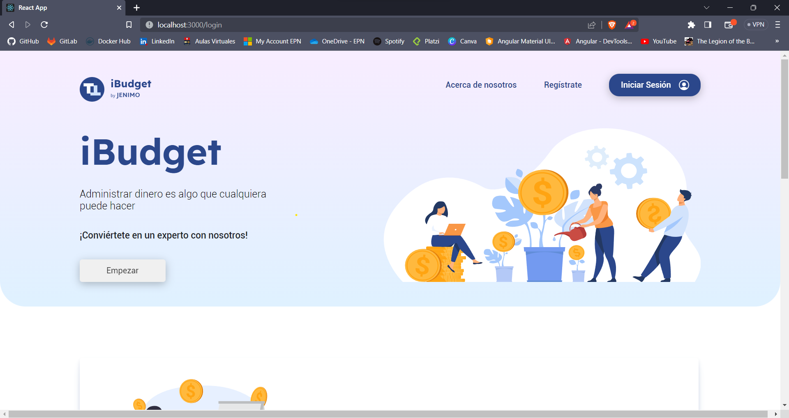
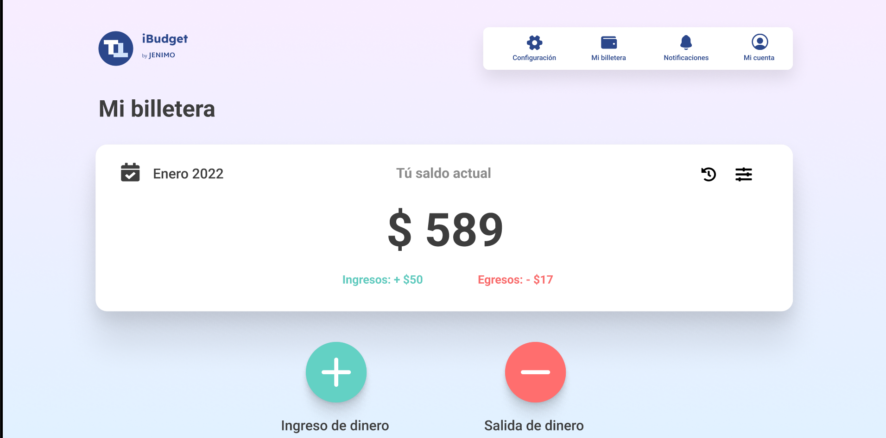
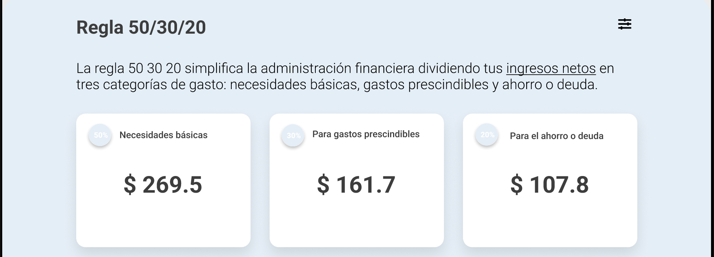
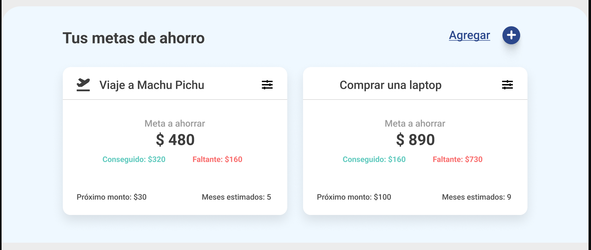
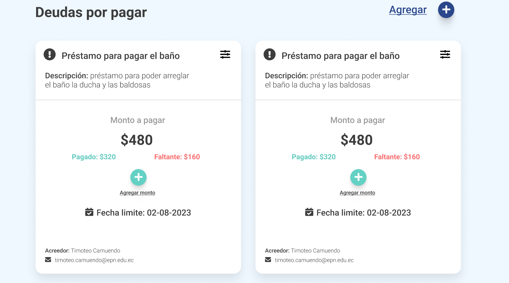

# iBudget

## Autores
- `Timoteo Alberto Camuendo Sinchico`
- `Jenny Lizeth Llano Tumbaco` 

## Descripción

iBudget es una aplicación web permite a sus usuarios registrar sus entradas y salidas de dinero. Además, que puedan registrar sus metas de ahorro y deudas de tal manera que puedan conocer sus avances.

---
#### Canvas de la aplicación ingreso y egreso de dinero
En esta sección se puede registrar los ingresos y egresos de dinero, además de poder visualizarlos en un canvas 
principal de la aplicación

---

#### Regla del 50/30/20
En esta sección se puede visualizar la regla del 50/30/20, la cual nos permite saber que porcentaje de nuestro
ingreso se debe destinar a gastos, ahorro e inversiones.
Esto es de gran ayuda para poder llevar un control de nuestros gastos y así poder cumplir nuestras metas de ahorro.

---

#### Metas de ahorro
En esta sección se puede registrar las metas de ahorro que se desean cumplir, además de poder visualizarlas en una tarjeta
de la aplicación.

---

#### Registro de deudas
En esta sección se puede registrar las deudas que se tienen, además de poder visualizarlas en una tarjeta
de la aplicación.
Es importante registrar las deudas para poder llevar un control de ellas y así poder cumplir con el pago de las mismas.

---

## Funcionalidades

- Registro de usuarios
- Inicio de sesión
- Registro de ingresos y egresos
- Registro de metas de ahorro
- Registro de deudas
- Visualización de ingresos y egresos
- Visualización de metas de ahorro
- Visualización de deudas
- Visualización de flujo de dinero con su respectiva fecha

---

## Instalación
1. Clonar el repositorio
2. Instalar las dependencias
3. Entrar a la carpeta del proyecto y ejecutar el comando `npm start`
4. Abrir el navegador en la dirección `localhost:3000`

---

## Tecnologías
- Node.js
- React.js
- Firebase
- Next.js

---

## Licencia
Todos los derechos reservados

---

## Enlaces
- [Repositorio en GitHub]( https://github.com/Timo-Teo/iBudget)
- [Video de la aplicación](https://epnecuador-my.sharepoint.com/personal/jenny_llano_epn_edu_ec/_layouts/15/stream.aspx?id=%2Fpersonal%2Fjenny%5Fllano%5Fepn%5Fedu%5Fec%2FDocuments%2FMov%2DWeb%2DAvanz%2FWeb%20Avanzadas%2FProyectoIIB%2DIBudget%2Emp4&ga=1)

---

## Referencias
- [React](https://es.reactjs.org/)
- [Next.js](https://nextjs.org/)
- [Firebase](https://firebase.google.com/)
- [Material UI](https://material-ui.com/)

---

## Contribuciones
- [Timoteo Camuendo](https://github.com/Timo-Teo)
- [Jenny Llano](https://github.com/JennyL00)

---

